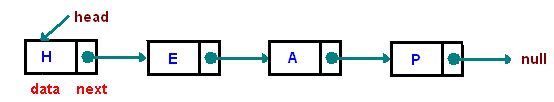

# Linked-Lists
Linked Lists is the most basic and fundamental data structure, that functions similarly to an array.
The principal benefit of a linked list over a conventional array is that the list elements can easily
be inserted or removed without reallocation of any other elements.

A linked list is a dynamic data structure. The number of nodes in a list is not fixed and can grow and
shrink on demand. Any application which has to deal with an unknown number of objects will need to use a linked list.

Another disadvantage is that a linked list uses more memory compare with an array - we extra 4 bytes
(on 32-bit CPU) to store a reference to the next node.

Interesting fact:
-A javascript file cannot have more that one class(ESLINT);

`File has too many classes (2). Maximum allowed is 1.eslintmax-classes-per-file`

